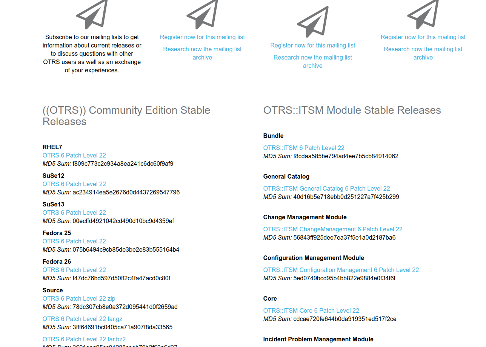

## PROJETO DE INTEGRAÇÃO DO ZABBIX COM OTRS (TICKET TOOL)

- Eu vou demonstrar o projeto usando scripts (Bash), é uma forma automatizada de instalar as aplicações. Depois será abordado o uso do Ansible para gestão de configuração nos hosts remoto, onde criarei uma playbook para promover um ambiente automatizado.

### Etapa 1 - Preparação e instalação das aplicações OTRS e Zabbix

- Instalação da aplicação OTRS: https://medium.com/@amaurybsouza/otrs6-d4abf0915de

- Instalação da aplicação Zabbix: https://medium.com/@amaurybsouza/instalação-do-zabbix-server-4-2-all-in-one-748622cdbf2

### Etapa 2 - Instalação de dependências no sistema

- Vamos utilizar o seguinte cenário para esse projeto:
  - CentOS 7
  - Zabbix 3.4
  - OTRS 6
  - Python 2.7
  
- Dependências a serem instaladas:
  
  - $ yum install python-pip
  - $ pip install python-otrs
  - $ pip install zabbix-api
  - $ yum install -y "perl(Crypt::SSLeay)" "perl(Date::Format)" "perl(DateTime)" "perl(IO::Socket::SSL)"            "perl(LWP::UserAgent)" "perl(Net::DNS)" "perl(Net::LDAP)" "perl(Template)" "perl(URI)" "perl(XML::LibXSLT)" perl-core procmail

### Etapa 3 - Download de pacote

- Você deve fazer o download do pacote Bundle no site do OTRS (Bundle - OTRS::ITSM 6 Patch Level 22)

  - https://community.otrs.com/download-otrs-community-edition/ ou siga a página abaixo:
  
  

### Etapa 4 - Instalação do pacote no menu de administração do OTRS

- Navegar até o gerenciador de pacotes do OTRS, e adicionar o pacote que foi baixado:

- Basta clicar em instalar pacote que o OTRS reconhece.

### Etapa 5 - Importação do web service para o OTRS

- Vamos começar acessando o gerenciamento de web services do sistema dentro do painel de administração do OTRS.
- Para adicionar o web service, basta clicar em adicionar serviço web e selecione o arquivo IntegraZabbix.yml

### Etapa 6 - Criação dos atendentes no sistema OTRS

- Nessa parte temos que criar os atendentes, navegue até a imagem abaixo no menu administração.

[atendentesotrs.png](images/atendentesotrs.png)

- sdsdsdsd

