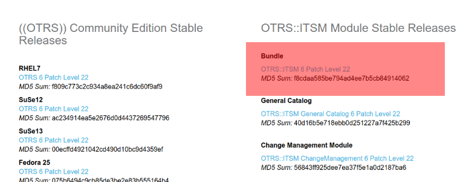
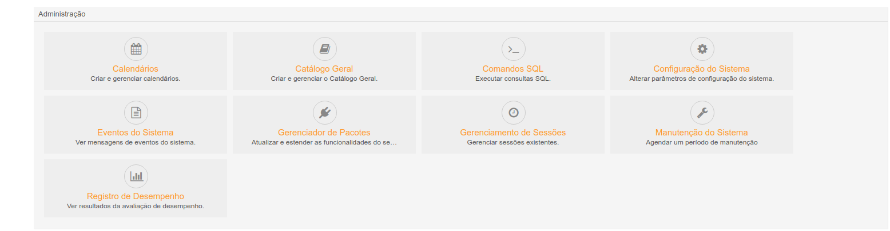
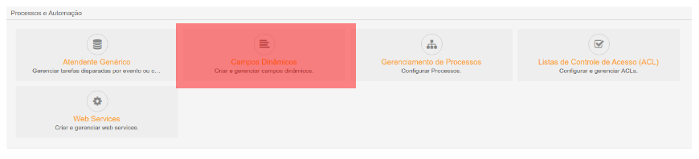
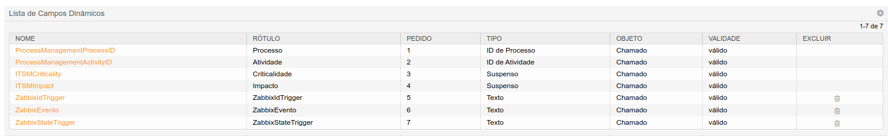
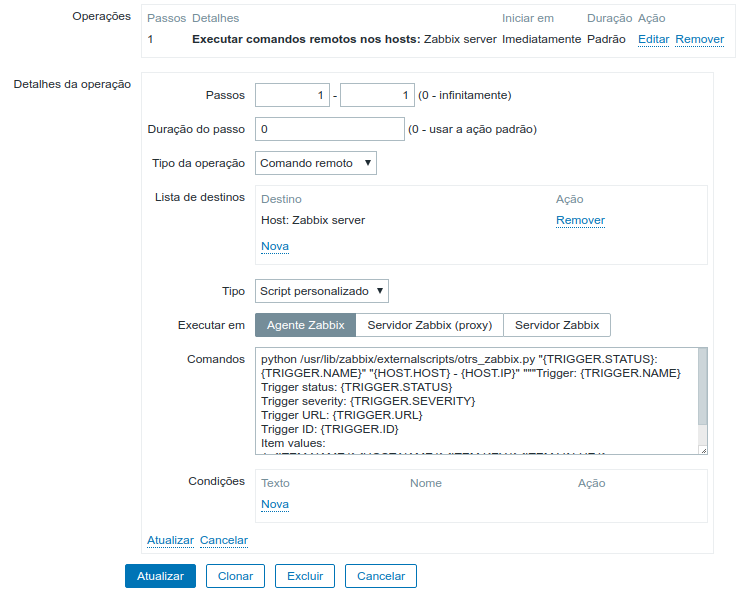
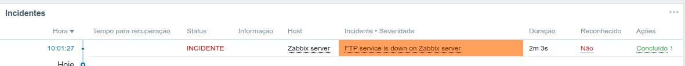
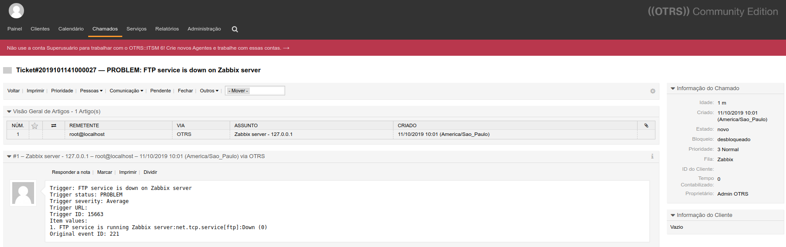

## PROJETO DE INTEGRAÇÃO DO ZABBIX COM OTRS (TICKET TOOL)

- Basicamente esse projeto mostra como definir toda a stack de configuração do zabbix 3.4 e OTRS 6 para abertura automática de tickets direto na tela do OTRS, através do acionamento de uma trigger do zabbix. Depois será abordado o uso do Ansible para gestão de configuração no hosts remoto, onde criarei uma playbook para promover um ambiente automatizado.

### Etapa 1 - Preparação e instalação das aplicações OTRS e Zabbix

`- Instalação da aplicação OTRS: https://medium.com/@amaurybsouza/otrs6-d4abf0915de`

`- Instalação da aplicação Zabbix: https://medium.com/@amaurybsouza/instalação-do-zabbix-server-4-2-all-in-one-748622cdbf2`

Caso você queira estudar a API de integração e os módulos, segue o link do projeto abaixo:

`Projeto: https://github.com/ewsterrenburg/python-otrs`

### Etapa 2 - Instalação de dependências no sistema

- Vamos utilizar o seguinte cenário para esse projeto:
  - CentOS 7
  - Zabbix 3.4
  - OTRS 6
  - Python 2.7
  
- Dependências a serem instaladas:
  
  - $ yum install python-pip
  - $ pip install python-otrs
  - $ pip install zabbix-api
  - $ yum install -y "perl(Crypt::SSLeay)" "perl(Date::Format)" "perl(DateTime)" "perl(IO::Socket::SSL)"            "perl(LWP::UserAgent)" "perl(Net::DNS)" "perl(Net::LDAP)" "perl(Template)" "perl(URI)" "perl(XML::LibXSLT)" perl-core procmail

### Etapa 3 - Download de pacote

- Você deve fazer o download do pacote Bundle no site do OTRS (Bundle - OTRS::ITSM 6 Patch Level 22)

  `- https://community.otrs.com/download-otrs-community-edition/ conforme a página abaixo:`
  
  

### Etapa 4 - Instalação do pacote no menu de administração do OTRS

- Navegar até o gerenciador de pacotes do OTRS, e adicionar o pacote que foi baixado:

- Basta clicar em instalar pacote que o OTRS reconhece.

### Etapa 5 - Importação do web service para o OTRS

- Vamos começar acessando o gerenciamento de web services do sistema dentro do painel de administração do OTRS.
- Para adicionar o web service, basta clicar em adicionar serviço web e selecione o arquivo IntegraZabbix.yml

### Etapa 6 - Criação dos atendentes no sistema OTRS

- Nessa parte temos que criar os atendentes, navegue até a imagem abaixo no menu administração.

- Ao clicar em `Atendentes`, você deve preencher os campos:
  - Título;
  - Nome;
  - Sobrenome;
  - Login;
  - Senha;
  - E-mail;
  - Validade.

- Temos que ficar atentos ao ID do usuário que será criado pois no script Python teremos que passar esse ID.

### Etapa 7 - Criação de estado de chamado no OTRS

- Para isso acesse o painel de administração do OTRS, Configurações de chamado -> Estados.
- Clique em `Adicionar Estado` e complete os campos:
  - Nome;
  - Tipo do estado;
  - Validade;
  - Comentários.
 
### Etapa 8 - Criação de campos dinâmicos no OTRS

- Nessa parte vamos criar os campos dinâmicos no OTRS para que seja possível gerenciar as triggers.
- Vamos adicionar três campos:
  - ZabbixIdTrigger
  - ZabbixEvento
  - ZabbixStateTrigger

- Veja como ficou os campos depois de adicionados:

### Etapa 9 - Ativar comandos remotos do Zabbix

- Nessa etaá temos que ativar os comandos remotos no servidor do zabbix para que nossa ação funcione de forma íntrega.
- Abra o arquivo `/etc/zabbix/zabbix_agentd.conf` e adicione 1 ao valor da chave:

`EnableRemoteCommands=1`

- Feito isso, reinicie o serviço do zabbix-agent

### Etapa 10 - Configurar ação no Zabbix

- Veja abaixo o modelo de ação no Zabbix:

### Etapa 11 - Confira a abertura de chamados 

- Nessa etapa irei mostrar o chamado sendo aberto no OTRS 6:

- Agora veja como fica no OTRS 6 o chamado:

asasasasas

